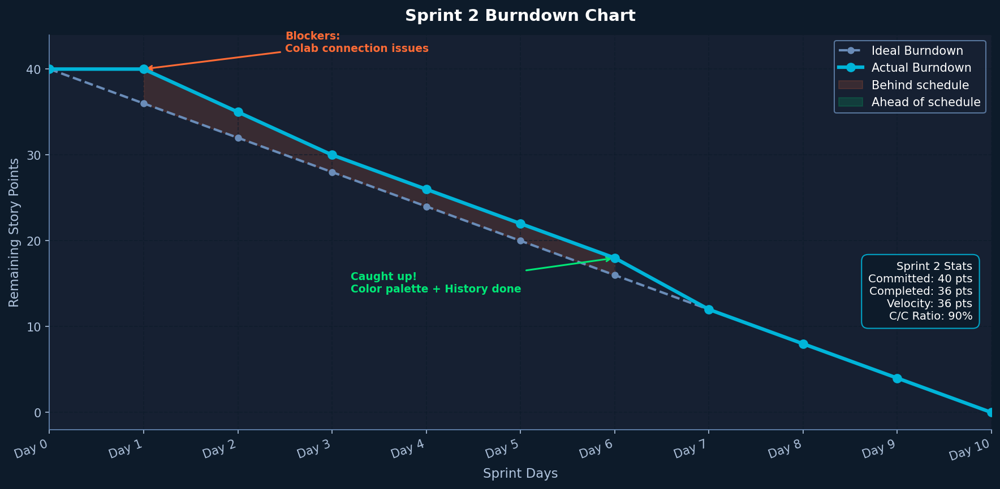

# Sprint 2 Burndown Chart and Completed Tasks

**Course:** CS 691 — Computer Science Capstone Project, Spring 2026  
**Team:** Group 4 — AI Interior Designer v2

> This burndown chart covers **Sprint 2 only** — not cumulative across sprints.

---

## Sprint 2 Goal

Add authentication, loading states, compare slider, color palette, and Firebase auto-connect so users never manually enter a backend URL.

---

## Sprint 2 Burndown Chart

| Day | Remaining Story Points |
|-----|----------------------|
| Day 1 | 15 |
| Day 2 | 15 |
| Day 3 | 13 |
| Day 4 | 11 |
| Day 5 | 11 |
| Day 6 | 8 |
| Day 7 | 6 |
| Day 8 | 4 |
| Day 9 | 2 |
| Day 10 | 0 |

**Committed:** 15 story points | **Completed:** 15 | **Rate:** 100%

---

## Completed User Stories

| Story ID | User Story | Points | Status |
|----------|-----------|--------|--------|
| US-S2-01 | Email/password login | 2 | ✅ Done |
| US-S2-02 | Google OAuth login | 2 | ✅ Done |
| US-S2-03 | Loading spinner + progress bar during generation | 2 | ✅ Done |
| US-S2-04 | Before/after drag compare slider | 3 | ✅ Done |
| US-S2-05 | Color palette selector (8 presets) | 2 | ✅ Done |
| US-S2-06 | Colab auto-registers URL in Firebase Firestore | 2 | ✅ Done |
| US-S2-07 | Status dot — green/yellow/red AI connection indicator | 1 | ✅ Done |
| US-S2-08 | Toast notification system (replaces browser alerts) | 1 | ✅ Done |

---

## Sprint 2 Retrospective

**What went well:**
- Firebase auto-connect was the biggest UX improvement of the project
- Compare slider implementation was simpler than expected
- Firebase Auth (email + Google) both worked without issues

**What could be improved:**
- No undo feature yet — added to Sprint 3
- Object editing not yet implemented — highest priority for Sprint 3

**Action items for Sprint 3:**
- Implement YOLOv8 object detection
- Implement SAM + inpainting for object replacement
- Add undo/history
- Add zoom, pan, and image download
