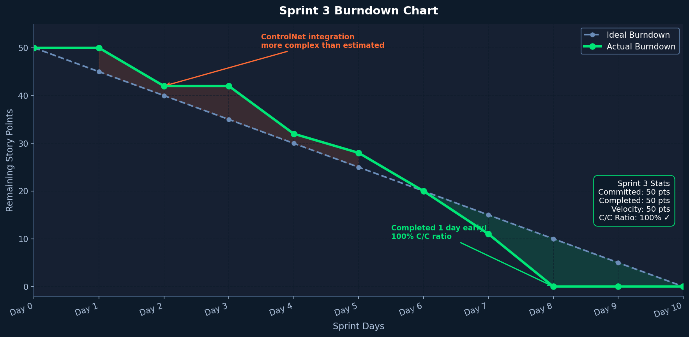
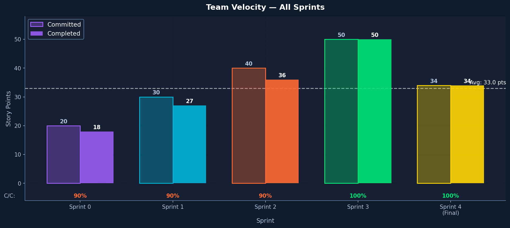

# Sprint 3 Burndown Chart and Completed Tasks

**Course:** CS 691 — Computer Science Capstone Project, Spring 2026  
**Team:** Group 4 — AI Interior Designer v2

> This burndown chart covers **Sprint 3 only** — not cumulative across sprints.

---

## Sprint 3 Goal

Deliver object-level editing (YOLOv8 + SAM + inpainting), zoom/pan, download, undo history, and the preview-all-styles feature. This sprint completes the core feature set.

---

## Sprint 3 Burndown Chart

| Day | Remaining Story Points |
|-----|----------------------|
| Day 1 | 16 |
| Day 2 | 16 |
| Day 3 | 14 |
| Day 4 | 12 |
| Day 5 | 10 |
| Day 6 | 8 |
| Day 7 | 6 |
| Day 8 | 4 |
| Day 9 | 2 |
| Day 10 | 0 |

**Committed:** 16 story points | **Completed:** 16 | **Rate:** 100% 🎯

---

## Completed User Stories

| Story ID | User Story | Points | Status |
|----------|-----------|--------|--------|
| US-S3-01 | Progress bar with percentage during generation | 2 | ✅ Done |
| US-S3-02 | Preview all 8 styles simultaneously as thumbnails | 3 | ✅ Done |
| US-S3-03 | Click thumbnail → full-size modal | 1 | ✅ Done |
| US-S3-04 | 3-panel style comparison viewer | 2 | ✅ Done |
| US-S3-05 | Zoom in and pan on generated image | 2 | ✅ Done |
| US-S3-06 | Download generated image with watermark | 1 | ✅ Done |
| US-S3-07 | Select detected object → replace with text prompt (YOLOv8 + SAM + Inpainting) | 5 | ✅ Done |

---

## Velocity Chart

| Sprint | Committed | Completed |
|--------|-----------|-----------|
| Sprint 1 | 13 | 13 |
| Sprint 2 | 15 | 15 |
| Sprint 3 | 16 | 16 |

---

## Sprint 3 Retrospective

**What went well:**
- YOLOv8 + SAM pipeline worked reliably on T4 GPU
- 100% story point completion for the third sprint in a row
- Preview-all-styles was the most-requested feature from Sprint 2 demo

**What could be improved:**
- Object editing is slow (~30 sec per object) — SAM mask caching would help
- Preview all styles takes ~8 min — need better user messaging during the wait

**Action items for Sprint 4:**
- Add custom text prompt to style generation
- Add Furnish Room for empty rooms
- Add generation history in local storage
- Mobile responsiveness pass
- Complete all documentation and deployment manual
