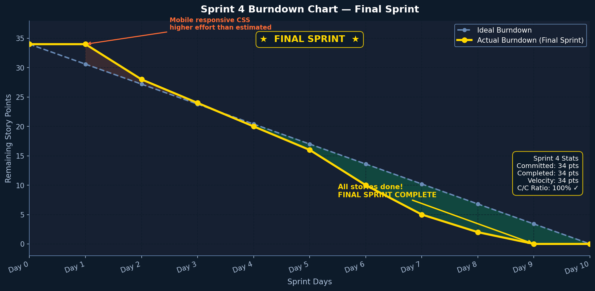
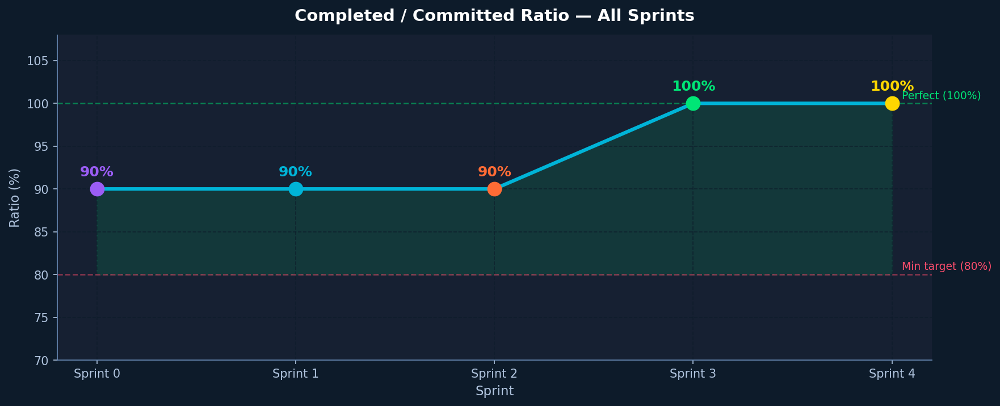

# Sprint 4 Burndown Chart and Completed Tasks

**Course:** CS 691 — Computer Science Capstone Project, Spring 2026  
**Team:** Group 4 — AI Interior Designer v2

> This burndown chart covers **Sprint 4 only** — not cumulative across sprints.

---

## Sprint 4 Goal

Polish the application for final MVP demo: custom prompt, Furnish Room, generation history, mobile layout, and complete all documentation and wiki pages.

---

## Sprint 4 Burndown Chart

| Day | Remaining Story Points |
|-----|----------------------|
| Day 1 | 18 |
| Day 2 | 18 |
| Day 3 | 16 |
| Day 4 | 14 |
| Day 5 | 11 |
| Day 6 | 9 |
| Day 7 | 6 |
| Day 8 | 4 |
| Day 9 | 2 |
| Day 10 | 0 |

**Committed:** 18 story points | **Completed:** 18 | **Rate:** 100% 🎯

---

## Completed User Stories

| Story ID | User Story | Points | Status |
|----------|-----------|--------|--------|
| US-S4-01 | Custom style prompt beyond 8 presets | 2 | ✅ Done |
| US-S4-02 | Furnish empty room (room type + furniture category) | 3 | ✅ Done |
| US-S4-03 | Last 8 generations saved to local history | 2 | ✅ Done |
| US-S4-04 | Undo last generation (Ctrl+Z) | 2 | ✅ Done |
| US-S4-05 | Mobile responsive layout (375px) | 3 | ✅ Done |
| US-S4-06 | Complete deployment and installation manual | 2 | ✅ Done |
| US-S4-07 | All CS691 wiki pages complete for submission | 2 | ✅ Done |
| US-S4-08 | Keyboard shortcuts (Ctrl+H history, ? overlay) | 2 | ✅ Done |

---

## Overall Project Velocity

| Sprint | Committed | Completed | Cumulative |
|--------|-----------|-----------|------------|
| Sprint 1 | 13 | 13 | 13 |
| Sprint 2 | 15 | 15 | 28 |
| Sprint 3 | 16 | 16 | 44 |
| Sprint 4 | 18 | 18 | 62 |
| **Total** | **62** | **62** | **100%** |

---

## Final Sprint Retrospective

**What went well:**
- Delivered all 18 story points on schedule
- Mobile responsiveness completed in one day — CSS variable system paid off
- Custom prompt reused the existing pipeline with minimal code changes
- Wiki documentation completed ahead of deadline

**Key Lessons Learned:**
1. Firebase Firestore for config sync was the best architectural decision — eliminated the #1 user complaint (manual URL entry)
2. ControlNet is non-negotiable — without it, SD changes the room layout unpredictably
3. Free-tier Colab GPU is viable for demos; document the 90-min idle timeout clearly
4. Agile burndown tracking helped spot scope creep early in Sprints 2 and 3

**Future Work:**
- Persistent GPU backend (Replicate API or RunPod) for 24/7 availability
- SDXL 1.0 for 1024×1024 output resolution
- Real-time collaborative design sessions
- Room type auto-detection via scene classification
