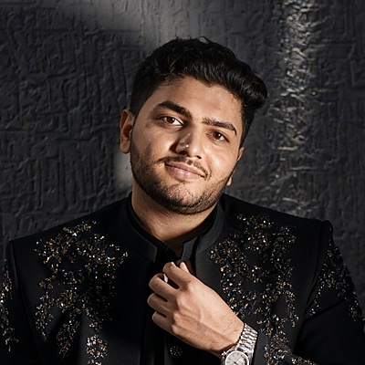

# Team Members & Responsibilities

**Course:** CS 691 — Computer Science Capstone Project, Spring 2026  
**Team:** Group 4 — AI Interior Designer v2

---

## Team Overview

<table>
  <tr>
    <td align="center" width="200">
       
      <strong>Nirav Borda</strong> 
      AI/ML Lead
    </td>
    <td align="center" width="200">
       
      <strong>Purvam Patel</strong> 
      Product Owner / PM
    </td>
    <td align="center" width="200">
       
      <strong>Prashant Mandaviya</strong> 
      Backend Lead
    </td>
    <td align="center" width="200">
       
      <strong>Jenil Sanchapara</strong> 
      Frontend Lead
    </td>
  </tr>
</table>

| Name | Role | Primary Focus |
|------|------|--------------|
| Nirav Borda | AI/ML Lead | Stable Diffusion, ControlNet, model optimization |
| Purvam Patel | Product Owner / Project Manager | Sprint planning, backlog, stakeholder coordination |
| Prashant Mandaviya | Backend Lead | Flask API, Colab integration, ngrok connectivity |
| Jenil Sanchapara | Frontend Lead | React UI, animations, responsive design |

---

## Individual Responsibilities

### Nirav Borda — AI/ML Lead

**Primary Responsibilities:**
- Implement and tune the Stable Diffusion 1.5 + ControlNet Canny pipeline
- Integrate YOLOv8x for real-time furniture detection
- Configure SAM ViT-H for precise object segmentation masks
- Optimize model parameters (inference steps, guidance scale, strength)
- Manage Google Drive model caching to reduce cold-start load times
- Write and maintain the Google Colab notebook (`AI_Interior_Designer_v2.ipynb`)
- Debug GPU memory issues (CUDA out of memory handling)

**Deliverables:**
- Working Colab notebook with all 4 AI models loaded
- Style transfer pipeline (8 styles × ControlNet)
- Object detection + segmentation + inpainting pipeline
- Furnish Room generation feature
- Model performance documentation

---

### Purvam Patel — Product Owner / Project Manager

**Primary Responsibilities:**
- Define and prioritize the product backlog
- Lead sprint planning, sprint review, and retrospective meetings
- Manage team Kanban board and task assignments
- Write user stories with acceptance criteria
- Coordinate between team members to resolve blockers
- Stakeholder communication and demo preparation
- Ensure all CS691 wiki deliverables are submitted on time

**Deliverables:**
- Product backlog (user stories, acceptance criteria)
- Sprint burndown charts
- Sprint retrospectives
- CS691 presentation slides and videos
- Wiki documentation compliance

---

### Prashant Mandaviya — Backend Lead

**Primary Responsibilities:**
- Design and implement Flask REST API (`app.py`)
- Set up ngrok tunnel for Colab-to-internet connectivity
- Implement Firebase Firestore auto-registration of Colab URL
- Handle CORS configuration for Vercel frontend
- Implement image I/O pipeline (upload → resize → save → serve)
- Build the `/health` endpoint for status monitoring
- Write backend deployment scripts and environment configuration

**Deliverables:**
- Flask backend with all 7 API endpoints
- Firebase auto-connect integration
- Backend deployment guide (Render.com)
- Environment variable templates (`.env.example`)
- Health check script (`check_health.py`)

---

### Jenil Sanchapara — Frontend Lead

**Primary Responsibilities:**
- Design and implement React 19 component architecture
- Build the dark/gold design system (CSS variables, typography)
- Implement Framer Motion page transitions and animations
- Build the before/after compare slider in `ResultView.js`
- Implement Firebase Authentication (Email + Google OAuth)
- Build `StyleSelector.js` with 8 style cards, palette picker, custom prompt
- Build `ObjectEditor.js` with YOLO chip list and inpainting prompt
- Implement Toast notification system
- Ensure mobile responsiveness (down to 375px)
- Deploy frontend to Vercel with CI/CD auto-deploy

**Deliverables:**
- Fully functional React frontend (10 components)
- Firebase Auth integration
- Vercel deployment with environment variables
- Responsive mobile layout
- Keyboard shortcut system

---

## Development Methodology

**Framework:** Agile Scrum  
**Sprint Length:** 2 weeks  
**Meetings:** Twice per week (stand-up + sprint planning/review)  
**Version Control:** Git + GitHub (feature branches, pull requests)  
**Communication:** Discord (async) + Zoom (sync meetings)
